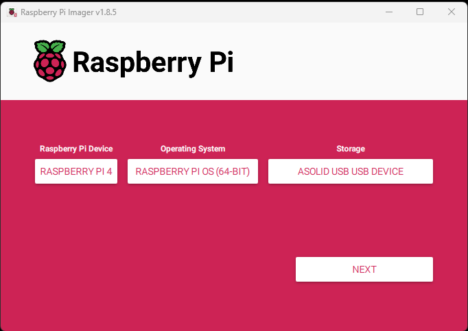
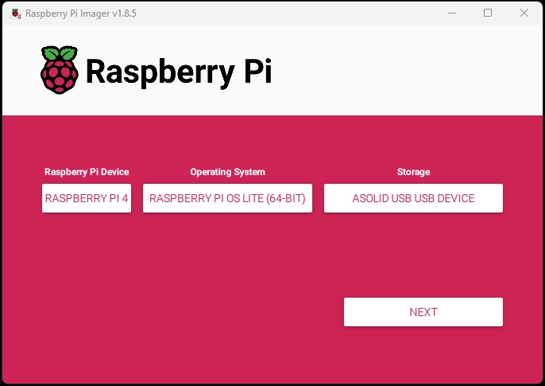
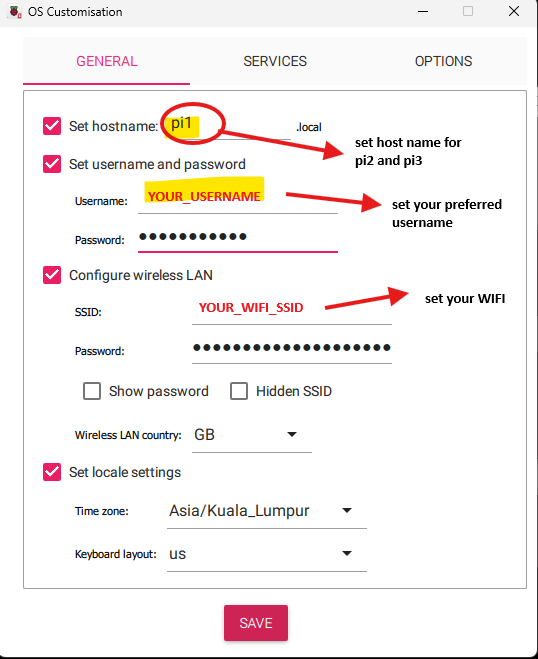
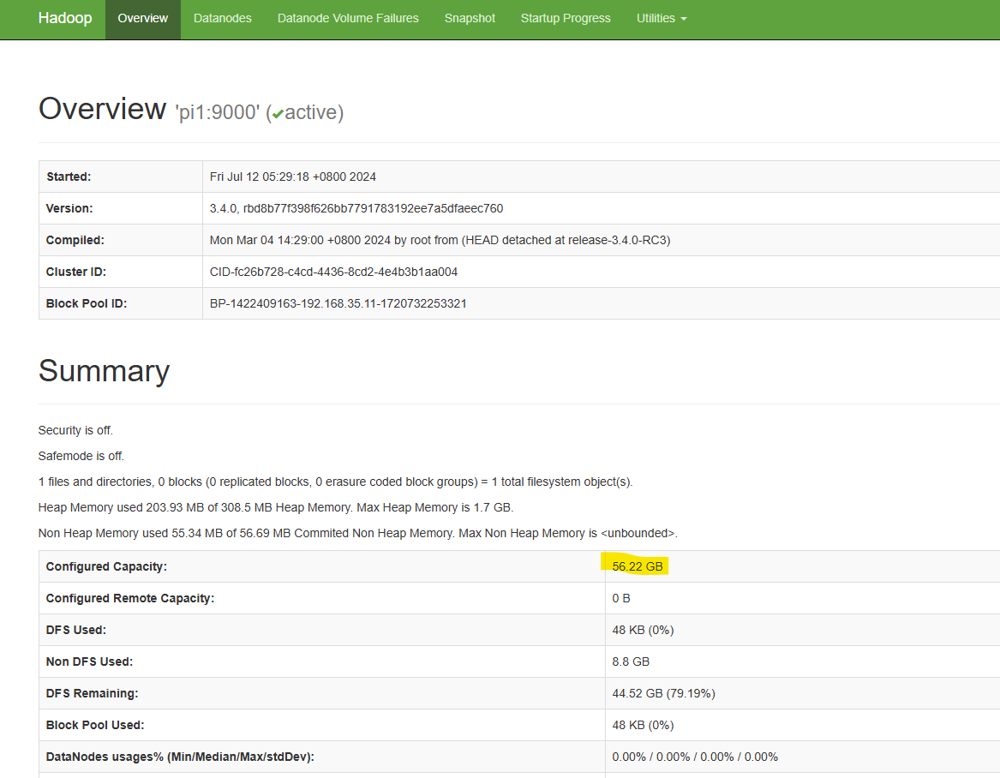
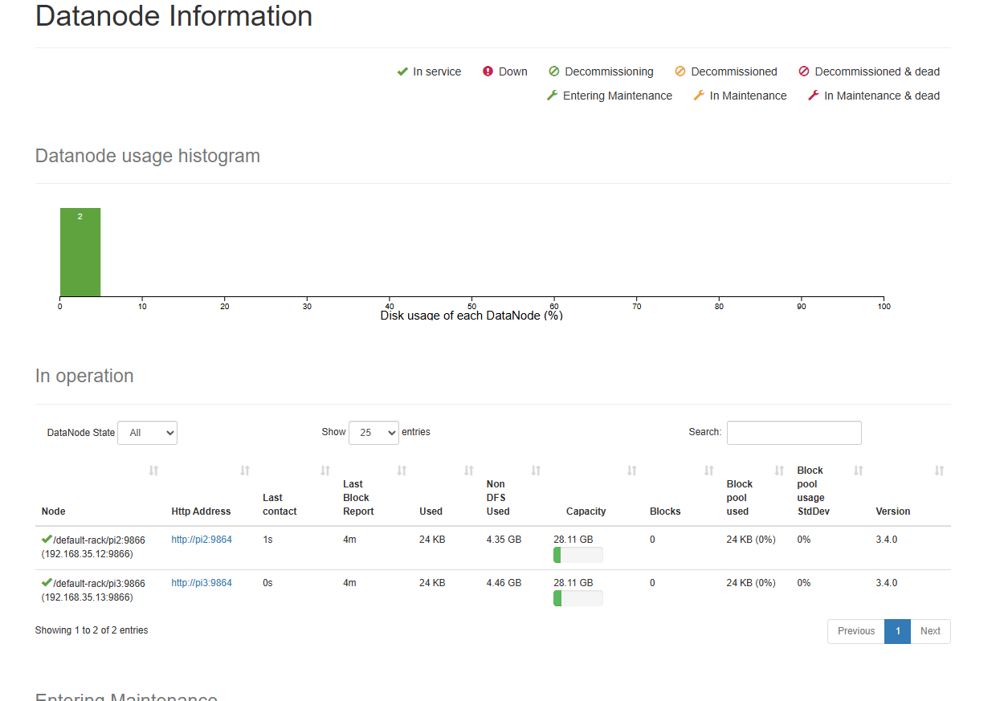
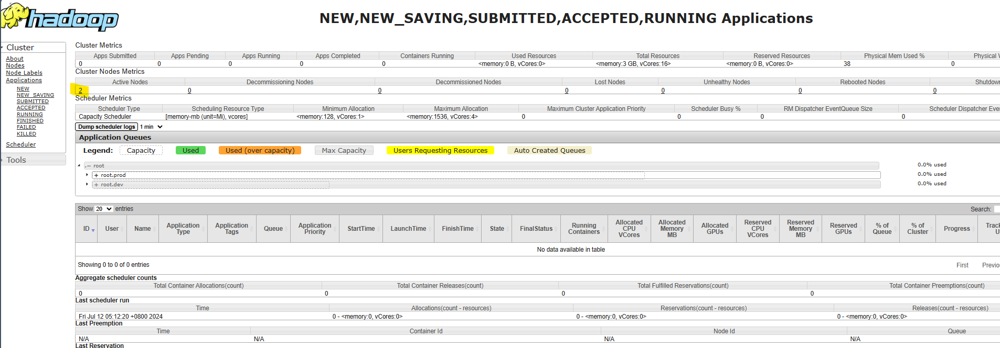
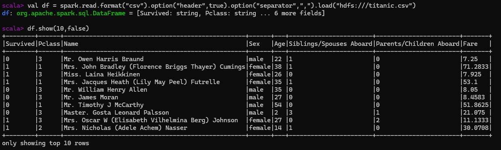
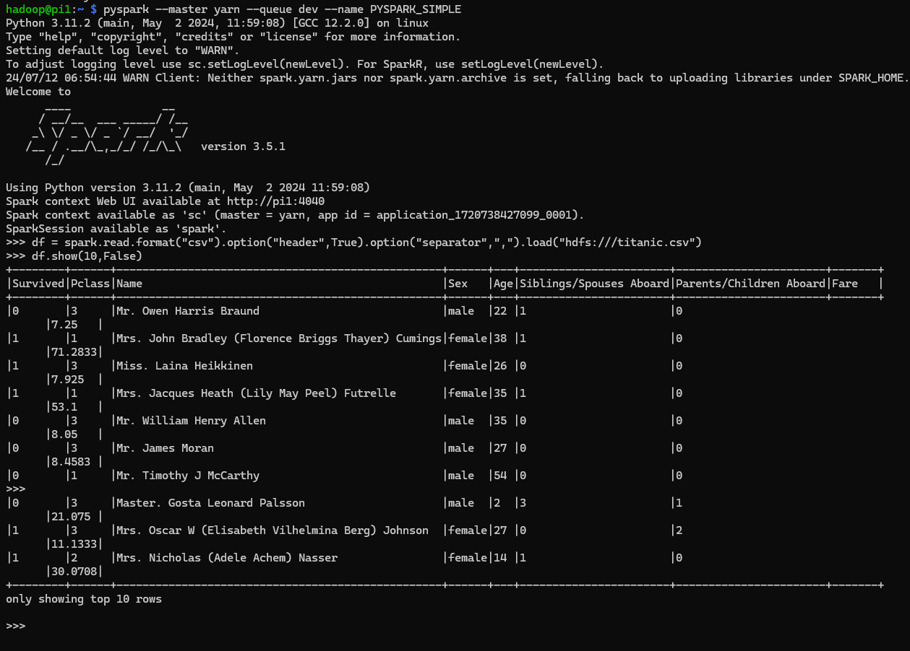
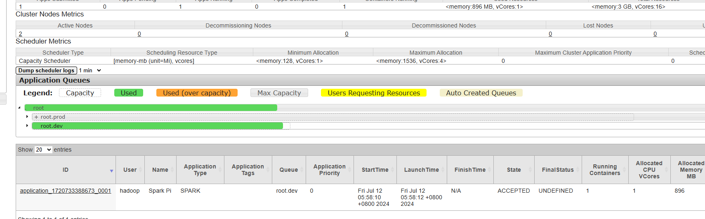
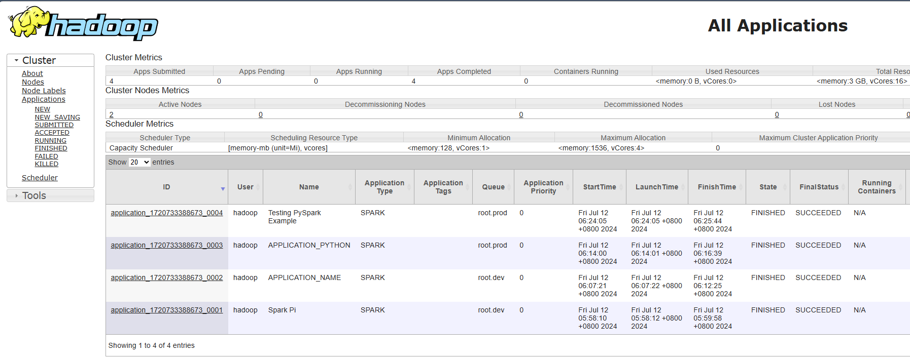

<p align="center">
  <a href="https://github.com/aimanamri/raspberry-pi4-hadoop-spark-cluster">
    
  </a>

  <a href="https://github.com/aimanamri/raspberry-pi4-hadoop-spark-cluster">
    
  </a>
  
  <a href="https://github.com/aimanamri/raspberry-pi4-hadoop-spark-cluster/stargazers">
    
  </a>

  <a href="https://github.com/aimanamri/raspberry-pi4-hadoop-spark-cluster/commits/main">
    
  </a>

  <a href="https://github.com/aimanamri/raspberry-pi4-hadoop-spark-cluster">
    
  </a>
</p>

# Build Raspberry Pi 4 Hadoop/Spark Cluster
Last updated : 14/7/2024 01:39 GMT+8 <br>
Author : [Aiman Amri](https://www.linkedin.com/in/aiman-amri/)<br>
Config files: https://github.com/aimanamri/raspberry-pi4-hadoop-spark-cluster/tree/main/config_files

---
## Project Introduction
This project serves as my self-documentation of learning distributed data storage, parallel processing, and Linux OS using Apache Hadoop, Apache Spark and Raspbian OS.

In this project, we'll be setup 3-node cluster using Raspberry Pi 4, install HDFS and run Spark processing jobs via YARN. Furthermore, we can horizontally scale up in the future to add more computing nodes.<br><br>
Although Hadoop provides MapReduce for processing, we won't cover that in this project. Instead, we will be more focusing on Spark because Spark is faster these days and easier to work with.

1. **Hadoop Distributed File System (HDFS)**: HDFS as the distributed storage solution, enabling efficient data management across multiple nodes.
2. **Hadoop YARN**: YARN acts as the resource manager, ensuring optimal allocation of computing resources for Hadoop and Spark jobs.
3. **Spark** : Distributed processing system used for big data workloads and it utilizes in-memory caching. APIs in Java, Scala, Python and R.
4. **Spark on YARN**: Instead of running Spark jobs in standalone mode, I've used Spark with YARN.

## Requirements
To replicate this project, you’ll need the following:
1. **Hadoop 3.4.0**: Install Hadoop to set up your distributed environment.
2. **Spark 3.5.1**: Install the latest version of Spark.
3. **Java 8**: Ensure Java 8 or 11 (runtime) is installed on your Raspberry Pi servers.
4. **Raspberry Pi 4**: Here, we're setup 3-node cluster, so we’ll need three [Raspberry Pi 4](https://docs.rs-online.com/b1fb/0900766b816fa153.pdf) devices, each with its power supply (5V/3A DC or 5.1V/ 3A DC minimum).
5. **Ethernet Cables** (if using wired connections)
6. **Micro SD card and Micro SD card reader**

## Sources 
[1] [How to Install and Set Up a 3-Node Hadoop Cluster](https://www.linode.com/docs/guides/how-to-install-and-set-up-hadoop-cluster/)<br>
[2] [Running Spark on Top of a Hadoop YARN Cluster](https://www.linode.com/docs/guides/install-configure-run-spark-on-top-of-hadoop-yarn-cluster/)<br>
[3] [Apache Hadoop Documentation](https://hadoop.apache.org/docs/stable/hadoop-project-dist/hadoop-common/ClusterSetup.html)<br>
[4] [Apache Spark Documentation](https://spark.apache.org/docs/latest/)<br>
[5] [Building a Raspberry Pi Hadoop / Spark Cluster](https://dev.to/awwsmm/building-a-raspberry-pi-hadoop-spark-cluster-8b2?fbclid=IwAR1jloBA6-6U3LhcxhkLT0Kq2Nx90YZjnCCIfT01SQSRs3mHHB87kt4AK4w)<br>
[6] [Getting Started with Hadoop & Apache Spark](https://youtube.com/playlist?list=PLJlKGwy-7Ac6ASmzZPjonzYsV4vPELf0x&si=IWXPkhC_r7mNN7IX)<br>
[7] [How to install hadoop cluster/multi node on ubuntu server 18.04](https://youtu.be/zGP0Uqm0SAo)<br>
[8] [Hadoop : Capacity Scheduler](https://hadoop.apache.org/docs/stable/hadoop-yarn/hadoop-yarn-site/CapacityScheduler.html#:~:text=etc%2Fhadoop%2Fcapacity%2Dscheduler,children%20of%20the%20root%20queue.)<br>

---

## Physical Cluster Setup
Stack all the Pis into a rack specialized for them. Plug in the power supply to turn it on. 
<p float="right">
   
   
   
</p>

## Raspberry Pi Initial Setting
1. **Installing OS**<br>
I went with **Raspberry Pi OS with desktop** for the master Pi, which has a GUI, and **Raspberry Pi OS Lite** for the worker Pis, which only have a CLI. Then, use the [Raspberry Pi Imager](https://www.raspberrypi.com/software/) to write the **Raspberry Pi OS 64 Bit** to each Pi. 

<p float="right">
  
   
</p>

2. **Configuring host name,SSH and network connection**<br>
I've set host name and SSH credential in each Pi. For network connection, I used Wi-Fi. If you are using wired connection, you can skip the Wi-Fi setup.<br>
However, it is preferable to use wired connection for stabilibility especially during transferring the files across Pis.
  
<p float="right">
   
   
</p>

### Basic Pi Configurations
#### Update packages, expand file system, then reboot.
**\*\*The following steps will need to be done on each Pi.\*\***
```bash
sudo apt update
sudo apt upgrade -y
sudo raspi-config --expand-rootfs
sudo reboot now
```
#### Configure Static IP
Static IP addresses are required. Here in this project, I assigned them on my home router. I am using `192.168.35.XX` (usually home network is `192.168.0.XX`) . Alternatively, you may assign them by editing `/etc/network/interfaces` file.

#### Configure Hostname/Host file
**\*\*The following steps will need to be done on each Pi.\*\***<br>
For hostname, I've already set it up during flashing the OS into the Pi. Alternatively, you can edit `/etc/hostname` file and then reboot.

For each node to communicate with each other by name, edit the `/etc/hosts` file to add the IP addresses of the three Raspberry Pi. Make sure to delete the localhost 127.0.0.1 line from the file.
File: `/etc/hosts`
```
192.168.35.11    pi1
192.168.35.12    pi2
192.168.35.13    pi3
```
#### Create Hadoop user and then log in as `hadoop` user 
**\*\*The following steps will need to be done on each Pi.\*\***
```bash
sudo adduser hadoop
sudo usermod -aG sudo hadoop
su - hadoop
```

**\*\*FROM HERE, MAKE SURE THAT YOU ARE LOGGED IN AS `hadoop` USER WHEN RUNNING ALL THE COMMANDS\*\***<br>

#### Setup Password-less SSH Authentication<br>
The  master node, `pi1` will use an SSH connection to connect to other nodes (`pi2`,`pi3`) with key-pair authentication. This will allow the master node to actively manage the cluster.<br>
**\*\*Perform these steps on the master Pi until only until directed to do otherwise.\*\***

0. **Create SSH Directory (`~/.ssh`) if not exist and set suitable permission accordingly.** 
```bash
mkdir ~/.ssh
touch ~/.ssh/config
sudo chmod 700 ~/.ssh/
sudo chmod 600 ~/.ssh/*
```

1. **Public/Private Key Pair**<br>
    Next, create an SSH key pair on the Pi using:
```bash
ssh-keygen -t rsa -b 4096
```
When generating this key, leave the password field blank so your Hadoop user can communicate unprompted.

2. Repeat SSH keygen on other nodes `pi2` and `pi3` while logging as `hadoop` user.

3. **SSH Aliases**<br>
   On every Pi, while logging as `hadoop` user: <br>
   Edit SSH config file using command below. 
```bash
nano ~/.ssh/config
```
File: `/home/hadoop/.ssh/config`
```
Host pi1
User hadoop
Hostname 192.168.35.11 

Host pi2
User hadoop
Hostname 192.168.35.12

Host pi3
User hadoop
Hostname 192.168.35.13
```
4. Then use the following command on all Pis (including `pi1`) to copy the public keys into `pi1`'s authorized key list:
```bash
ssh-copy-id pi1
```
5. Finally, you can copy `pi1`'s SSH configuration files to the rest of the Pi's using the following commands:<br>
(*piX* below refer to `pi2` , `pi3`)
```bash
scp ~/.ssh/authorized_keys piX:~/.ssh/authorized_keys
```

Now, we can SSH into any Pis from master without entering any password. Please double check this if it is working properly. <br>

#### Java 8 Installation
**\*\*Perform these steps on the master Pi until only until directed to do otherwise.\*\***<br>
To install Java 8, download the tar package from the official website of Oracle. The OpenJDK-8 is an older version so it is not available in the Debian repository. [See more.](https://itslinuxfoss.com/install-openjdk-8-debian-12/)

**DOWNLOAD LINK (Linux ARM64 Compressed Archive) :** https://www.oracle.com/java/technologies/javase/javase8u211-later-archive-downloads.html#license-lightbox <br>
Then, copy the tar package to worker nodes. (*piX* below refer to `pi2` , `pi3`)
```bash
scp .\jdk-8u401-linux-aarch64.tar.gz piX:~/
```
Repeat the steps below on each Pi.<br>
1. Run the following commands after downloading the tar package:
```bash
sudo mkdir /usr/lib/jvm/
sudo tar -zxvf jdk-8u401-linux-aarch64.tar.gz -C /usr/lib/jvm/
sudo update-alternatives --install /usr/bin/java java /usr/lib/jvm/jdk1.8.0_401/bin/java 1
```
2. Display Java version
```bash
java -version
```
The output will be as below:
```
java version "1.8.0_401"
Java(TM) SE Runtime Environment (build 1.8.0_401-b10)
Java HotSpot(TM) 64-Bit Server VM (build 25.401-b10, mixed mode)
```
3. To set up the environmental variables, run `sudo nano /etc/profile.d/java.sh`
```bash
export PATH=$PATH:/usr/lib/jvm/jdk1.8.0_401/bin/
export JAVA_HOME=/usr/lib/jvm/jdk1.8.0_401/
```
4. Load the variables using:
```bash
source /etc/profile.d/java.sh
```
5. Then, run the following to check Java installation path, `JAVA_HOME`:
```bash
echo $JAVA_HOME
```
Java 8 is completed!

---
## Hadoop 3.4.0 Installation 

### Hadoop Single Node Installation (for master only, `pi1`)
**\*\*Perform these steps on the master Pi until only until directed to do otherwise.\*\***<br>
1. Download Apache Hadoop 3.4.0 binary-aarch64 from [Apache Hadoop website](https://hadoop.apache.org/releases.html) by using wget command as below: 
```bash
wget https://dlcdn.apache.org/hadoop/common/hadoop-3.4.0/hadoop-3.4.0-aarch64.tar.gz
```
_Note : Binary download URL above may be different if different version is used_

2. Extract the file in `hadoop` user home directory, then delete the compressed file.
```bash
tar -xzvf hadoop-3.4.0-aarch64.tar.gz
rm hadoop-3.4.0-aarch64.tar.gz
```
#### Configure Hadoop
To get the HDFS up and running, we need to modify some configuration files.
##### Set environment variables
1. Add Hadoop binaries to your PATH. Edit `/home/hadoop/.profile` and add the following line:
File: `/home/hadoop/.profile`
```shell
PATH=/home/hadoop/hadoop-3.4.0/bin:/home/hadoop/hadoop-3.4.0/sbin:$PATH
```
This will enable us to run hadoop commands without going into the hadoop bin and sbin directory!

2. Add Hadoop to your PATH for the shell. Edit `.bashrc` and add the following lines:<br>
File: `/home/hadoop/.bashrc`
```shell
# path and options for java
export JAVA_HOME=/usr/lib/jvm/jdk1.8.0_401/

# path and options for Hadoop
export HADOOP_HOME=/home/hadoop/hadoop-3.4.0
export PATH=$PATH:$HADOOP_HOME/bin:$HADOOP_HOME/sbin

export HADOOP_INSTALL=$HADOOP_HOME
export HADOOP_MAPRED_HOME=$HADOOP_HOME
export HADOOP_COMMON_HOME=$HADOOP_HOME
export HADOOP_HDFS_HOME=$HADOOP_HOME
export HADOOP_INSTALL=$HADOOP_HOME
export YARN_HOME=$HADOOP_HOME
export HADOOP_COMMON_LIB_NATIVE_DIR=$HADOOP_HOME/lib/native
export HADOOP_CONF_DIR=$HADOOP_HOME/etc/hadoop
export HADOOP_OPTS="-Djava.library.path=$HADOOP_HOME/lib/native"
```
Then, source the `.bashrc` file to ensure it updates. 
```bash
source ~/.bashrc
```

3. **Set the value of `JAVA_HOME` in `hadoop-env.sh`** <br>
You'll have to scroll down to find the correct line. Uncomment the line and add the correct path of your JAVA installation path to the variable.
File: `/home/hadoop/hadoop-3.4.0/etc/hadoop/hadoop-env.sh`
```shell
export JAVA_HOME=/usr/lib/jvm/jdk1.8.0_401/
```
##### Edit config files (`core-site.xml`,`hdfs-site.xml`)

1. **Set NameNode location**<br>
   Edit `~/hadoop/etc/hadoop/core-site.xml` file to set the NameNode location to **`pi1`*** on port 9000
File: `~/hadoop-3.4.0/etc/hadoop/core-site.xml`

```xml
<configuration>
    <property>
        <name>fs.defaultFS</name>
        <value>hdfs://pi1:9000</value>
    </property>
</configuration>
```
2. **Set path for HDFS**<br>
   Edit `hdfs-site.xml` to resemble the following configuration:
File: `~/hadoop-3.4.0/etc/hadoop/hdfs-site.xml`
```xml
<configuration>
    <property>
        <name>dfs.replication</name>
        <value>1</value>
    </property> 
    <property>
		<name>dfs.namenode.name.dir</name>
        <value>/home/hadoop/hdfs/namenode/</value>
    </property> 
    <property>
		<name>dfs.datanode.name.dir</name>
        <value>/home/hadoop/hdfs/datanode/</value>
    </property> 
</configuration>
```
The first property, `dfs.replication`, indicates how many times data is replicated in the cluster (Default is `3`). You can set `2` to have all the data duplicated on the two nodes. Don’t enter a value higher than the actual number of worker nodes.

3. Then, inside of the `hadoop` home directory, create folders in each node (`pi1`,`pi2`,`pi3`) using:
```bash
mkdir -p /home/hadoop/hdfs/{namenode,datanode}
```

4. **Set YARN as Job Scheduler for MapReduce operations**<br>
Edit the `mapred-site.xml` file, setting YARN as the default framework for MapReduce operations:
File: `~/hadoop-3.4.0/etc/hadoop/mapred-site.xml`
```xml
<configuration>
    <property>
        <name>mapreduce.framework.name</name>
        <value>yarn</value>
    </property>
    <property>
        <name>yarn.app.mapreduce.am.env</name>
        <value>HADOOP_MAPRED_HOME=$HADOOP_HOME</value>
    </property>
    <property>
        <name>mapreduce.map.env</name>
        <value>HADOOP_MAPRED_HOME=$HADOOP_HOME</value>
    </property>
    <property>
        <name>mapreduce.reduce.env</name>
        <value>HADOOP_MAPRED_HOME=$HADOOP_HOME</value>
    </property>
    <property>
        <name>yarn.app.mapreduce.am.resource.memory-mb</name>
        <value>512</value>
    </property>
    <property>
        <name>mapreduce.map.resource.memory-mb</name>
        <value>256</value>
    </property>
    <property>
        <name>mapreduce.reduce.resource.memory-mb</name>
        <value>256</value>
    </property>
</configuration>
```
_Note : If you're running on **single node**: (1) Format the HDFS, (2) `start-dfs.sh` and then you can start exploring HDFS._ 

###  Hadoop Multi-Node Installation
#### Configure YARN
1. Edit `yarn-site.xml`, which contains the configuration options for YARN.<br>
To configure the ResourceManager to use the CapacityScheduler for setting up queues (**`dev`** and **`prod`** queues), the following property need to be included:
```xml
<property>
	    <name>yarn.resourcemanager.scheduler.class</name>
	    <value>org.apache.hadoop.yarn.server.resourcemanager.scheduler.capacity.CapacityScheduler</value>
</property>
```
File: `~/hadoop-3.4.0/etc/hadoop/yarn-site.xml`
```xml
<configuration>
    <property>
        <name>yarn.nodemanager.aux-services</name>
        <value>mapreduce_shuffle</value>
    </property>
    <property>
        <name>yarn.nodemanager.env-whitelist</name>
        <value>JAVA_HOME,HADOOP_COMMON_HOME,HADOOP_HDFS_HOME,HADOOP_CONF_DIR,CLASSPATH_PREPEND_DISTCACHE,HADOOP_YARN_HOME,HADOOP_MAPRED_HOME</value>
    </property>
    <property>
        <name>yarn.acl.enable</name>
        <value>0</value>
    </property>
    <property>
        <name>yarn.resourcemanager.hostname</name>
        <value>pi1</value>
    </property>
    <property>
        <name>yarn.nodemanager.aux-services</name>
        <value>mapreduce_shuffle</value>
    </property>
    <property>
        <name>yarn.nodemanager.resource.memory-mb</name>
        <value>1536</value>
    </property>
    <property>
        <name>yarn.scheduler.maximum-allocation-mb</name>
        <value>1536</value>
    </property>
    <property>
        <name>yarn.scheduler.minimum-allocation-mb</name>
        <value>128</value>
    </property>
    <property>
        <name>yarn.nodemanager.vmem-check-enabled</name>
        <value>false</value>
    </property>
    <property>
            <name>yarn.resourcemanager.scheduler.class</name>
            <value>org.apache.hadoop.yarn.server.resourcemanager.scheduler.capacity.CapacityScheduler</value>
    </property>

    <property>
        <name>yarn.scheduler.capacity.root.queues</name>
        <value>prod,dev</value>
    </property>

    <property>
        <name>yarn.scheduler.capacity.prod.capacity</name>
        <value>0.5</value>
    </property>

    <property>
        <name>yarn.scheduler.capacity.dev.capacity</name>
        <value>0.5</value>
    </property>

    <property>
        <name>yarn.scheduler.capacity.dev.maximum-capacity</name>
        <value>0.5</value>
    </property>

    <property>
        <name>yarn.scheduler.capacity.prod.maximum-capacity</name>
        <value>0.7</value>
    </property>
</configuration>
```

_Note:_<br>
Based on above properties, capacity of resource allocation of each queue is **`50%`**. We also define how much of our resources can be allocated to our queues at maximum. So, if one queue does not use all the resources allocated to it, then YARN will allocate those resources to the other queue. For example, `dev` queue will never use more than **`50%`** of the allocated resources in the system. However, YARN allows `prod` queue to use up to **`70%`** of the resource if `dev` queue is not used.


2. Then, edit `capacity-scheduler.xml` by copying exactly as written in this [file](https://raw.githubusercontent.com/aimanamri/raspberry-pi4-hadoop-spark-cluster/main/config_files/capacity-scheduler.xml).<br>
File: `~/hadoop-3.4.0/etc/hadoop/capacity-scheduler.xml`

#### Configure Master and Workers
**For the Master:**<br>
Edit `~/hadoop-3.4.0/etc/hadoop/master` file.
```
pi1
```

**For the Workers:**<br>
Edit `~/hadoop-3.4.0/etc/hadoop/workers` file.
```
pi2
pi3
```
#### Duplicate Config Files on Each Node<br>
1. SSH  into `pi2` and then `pi3` and run the following commands:
```bash
sudo mkdir hadoop-3.4.0
sudo chown -R hadoop:hadoop hadoop-3.4.0/
```
2. Copy the Hadoop config files to the worker nodes from master node:
```bash 
for pi in pi2 pi3; do rsync -avxP ~/hadoop-3.4.0/ $pi:/home/hadoop/hadoop-3.4.0/; done
```
#### Format HDFS
To run for the first time, the HDFS needs to be formatted. Hence, run the following command on **master node, `pi1`**:<br>
\**THIS WILL DELETE ALL DATA IN THE HDFS\**
```bash
hdfs namenode -format
```
Our Hadoop installation is now configured and ready to run!

#### Run HDFS and YARN
1. Run the following command to start the HDFS and the YARN:
```bash
start-dfs.sh && start-yarn.sh
```

2. Check that every process is running with the `jps` command on each node. On master node **pi1**, we should see the following (the PID number will be different):
```
5733 Jps
5623 ResourceManager
5435 SecondaryNameNode
5245 NameNode
```
And on **pi2** and **pi3** we should see the following:
```
1538 DataNode
1720 Jps
1640 NodeManager
```
3. To stop HDFS and YARN on master and worker nodes, run the following command from **pi1**:
```bash
stop-dfs.sh && stop-yarn.sh
```
##### Monitor HDFS and YARN via web UI<br>
- HDFS : http://pi1:9870
- YARN :  http://pi1:8088  (default port: 8088)  
<p float="right">
   
   
   
</p>
Now, we have a working Hadoop Cluster!

---
## Spark 3.5.1 Installation 
**\*\*The following steps only need to be performed on the master Pi, `pi1`\*\***<br>
1. Download Apache Spark 3.5.1 binary from [Apache Spark website](https://spark.apache.org/downloads.html) by using wget command as below: 
```bash
wget https://dlcdn.apache.org/spark/spark-3.5.1/spark-3.5.1-bin-hadoop3.tgz
```
_Note : Binary download URL above may be different if different version is used_

2. Extract the file in `hadoop` user home directory and rename the directory. Then, delete the compressed file.
```bash
tar -xzvf spark-3.5.1-bin-hadoop3.tgz
mv spark-3.5.1-bin-hadoop3 spark-3.5.1
rm spark-3.5.1-bin-hadoop3.tgz
```
### Set environment variables<br>
1. Add Spark binaries to your PATH. Edit `/home/hadoop/.profile` and add the following line:
File: `/home/hadoop/.profile`
```shell
# add SPARK bin and sbin to the end of the line PATH variable
PATH=/home/hadoop/spark-3.5.1/bin:/home/hadoop/spark-3.5.1/sbin:$PATH
```

2. Add Hadoop to your PATH for the shell. Edit `.bashrc` and add the following lines:
File: `/home/hadoop/.bashrc`
```shell
# path and options for Spark
export SPARK_HOME=/home/hadoop/spark-3.5.1
export PATH=$PATH:$SPARK_HOME/bin
export LD_LIBRARY_PATH=$HADOOP_HOME/lib/native:$LD_LIBRARY_PATH
export PYSPARK_PYTHON=python3
# add SPARK bin and sbin to the end of the line PATH variable
export PATH=/home/hadoop/spark-3.5.1/bin:/home/hadoop/spark-3.5.1/sbin:$PATH
```
Then, source the `.bashrc` file to ensure it updates. 
```bash
source ~/.bashrc
```

### Configuring YARN for Spark
1. **Configure Workers**<br>
   Copy `workers.template` to `workers` file in `spark-3.5.1/conf` directory.
```bash 
cp workers.template workers
``` 
Then, add the hostname/IP address of workers nodes at the end line inside `workers` file.<br>
File: `/home/hadoop/spark-3.5.1/conf/workers`
```
pi2
pi3
```

2. **Configure Memory Allocation**<br>
For nodes with less than 4G RAM, the default configuration is not adequate and may trigger swapping and poor performance, or even the failure of application initialization due to lack of memory. See more [[2]](https://www.linode.com/docs/guides/install-configure-run-spark-on-top-of-hadoop-yarn-cluster/)

```bash 
cp spark-defaults.conf.template spark-defaults.conf
``` 

- Edit `spark-defaults.conf` and add the following configurations.
File: `/home/hadoop/spark-3.5.1/conf/spark-defaults.conf`
```
spark.driver.memory 512m
spark.yarn.am.memory 512m
spark.executor.memory 512m
```

### Monitor Spark Applications
1. Enable the Web UI of Spark to track your submitted jobs by editing `spark-defaults.conf` file.<br>
Add the following lines.
File: `/home/hadoop/spark-3.5.1/conf/spark-defaults.conf`
```
spark.eventLog.enabled            true
spark.eventLog.dir                hdfs://pi1:9000/spark-logs
spark.history.provider            org.apache.spark.deploy.history.FsHistoryProvider
spark.history.fs.logDirectory     hdfs://pi1:9000/spark-logs
spark.history.fs.update.interval  10s
spark.history.ui.port             18080
```
 If you specify a bigger interval, you will have some delay between what you see in the History Server and the real time status of your application. If you use a shorter interval, you will increase I/O on the HDFS.

2. Restart HDFS and YARN if stopped. Then, create the log directory in the HDFS:
```bash
start-dfs.sh && start-yarn.sh
```
```bash
hdfs dfs -mkdir /spark-logs
```
3. Run the History Server, HDFS and YARN:
```bash
start-history-server.sh
```

4. To ensure all required daemons, run `jps` command. The output should be as below:
```
7971 Jps
7879 HistoryServer
7417 ResourceManager
7195 SecondaryNameNode
7038 NameNode
```

5. Run the Pi parallel processing job again to generate logs in the HDFS:
```bash
spark-submit --class org.apache.spark.examples.SparkPi --master yarn --queue dev /home/hadoop/spark-3.5.1/examples/jars/spark-examples_2.12-3.5.1.jar 10 
```
6. Access the History Server by navigating to http://pi1:18080 in a web browser:

7. To stop all running daemons:
```bash
stop-dfs.sh && stop-yarn.sh && stop-history-server.sh
```

### Running the Spark Interactive Shell
Ensure that HDFS and YARN are running. To confirm, run `jps` on each of the nodes.

As an example, we are going to use Titanic dataset.
Download the CSV file using wget on another terminal:
```bash
wget https://web.stanford.edu/class/archive/cs/cs109/cs109.1166/stuff/titanic.csv
```
Then, upload it to HDFS directory and then confirm the file is already uploaded.
```bash
hdfs dfs -put ~/titanic.csv /titanic.csv
```
```bash
hdfs dfs -ls /
```

#### Using the Spark Shell (Scala)
1. Start Spark shell.
```bash
spark-shell --master yarn --queue dev --name APPLICATION_NAME_SCALA
```
2. Loading Data
```scala
val df = spark.read.format("csv").option("header",true).option("separator",",").load("hdfs:///titanic.csv")
```
```scala
df.show(10,false)
```
 

3. To exit, enter:
```bash
:q
```

#### Using the PySpark (Python)
1. Start PySpark shell.
```bash
pyspark --master yarn --queue dev --name APPLICATION_NAME_PYSPARK
```
2. Loading Data
```python
df = spark.read.format("csv").option("header",True).option("separator",",").load("hdfs:///titanic.csv")
```
```python
df.show(10,False)
```

 

3. To exit, enter:
```bash
exit()
```

### Submit file as Spark Job/Application to the YARN Cluster<br>
Here, I will show only for Python language. But, you can also run Scala and R script.
#### Python
1. Create Python file as `script.py`.
2. Edit the file to run simple task..
```python
from pyspark.sql import SparkSession
from pyspark.sql.functions import col

# Create a SparkSession
spark = SparkSession.builder.appName("Testing PySpark Example").getOrCreate()

sample_data = [{"name": "John    D.", "age": 30},
  {"name": "Alice   G.", "age": 25},
  {"name": "Bob  T.", "age": 35},
  {"name": "Eve   A.", "age": 28}]

df = spark.createDataFrame(sample_data)

from pyspark.sql.functions import col, regexp_replace

# Remove additional spaces in name
def remove_extra_spaces(df, column_name):
    # Remove extra spaces from the specified column
    df_transformed = df.withColumn(column_name, regexp_replace(col(column_name), "\\s+", " "))

    return df_transformed

transformed_df = remove_extra_spaces(df, "name")

transformed_df.show()
```
3. Submit Python script as Spark job. 
```bash
spark-submit --master yarn --queue prod ~/script.py
```

**Other examples to run Scala and R:**
```bash
# For Scala and Java, use run-example:
./bin/run-example SparkPi

# For R examples, use spark-submit directly:
./bin/spark-submit examples/src/main/r/dataframe.R
```
 
 

We now have a working Spark Cluster. Keep exploring!

---

## More Information
- [HDFS Shell Documentation](https://hadoop.apache.org/docs/current/hadoop-project-dist/hadoop-common/FileSystemShell.html)
- [PySpark Documentation](https://spark.apache.org/docs/latest/api/python/index.html)
- [Submitting Spark Applications](https://spark.apache.org/docs/latest/submitting-applications.html)
